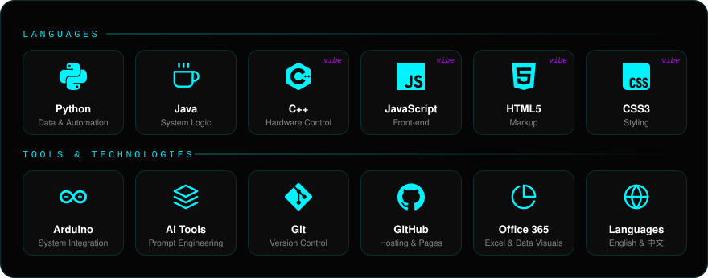

---

## 🚀 About Me / 关于我

- 🔭 Currently working as **Global Business Lead** at Tutturo LLC
- 🎓 Studying **Finance and Computer Science** at Rutgers University *(B.S., expected May 2029)*
- 🌱 Learning **Advanced Finance, AI Tool Integration, and Full-Stack Development**
- 🤝 Looking to collaborate on **open-source hardware** (like my [Magic Glove](https://github.com/LucasYanzy/Magic-Glove) project) and **AI-driven applications**
- 💬 Ask me about **Python, Java, C++ (Vibe Coding), and hardware integration with Arduino**
- 📫 How to reach me: **[LucasYanzy@outlook.com](mailto:LucasYanzy@outlook.com)** or via [LinkedIn](https://www.linkedin.com/in/lucasyanzy/)
- ⚡ Fun fact: I founded a lake protection foundation and led a biodiversity study across 20 wetland zones in Kunming!

## 🛠️ Tech Stack / 技术栈

  

Tiles tagged <i>vibe</i> are built with a Vibe Coding (AI-assisted) workflow.

## 💼 Experience & Leadership / 经历

- **Global Business Lead** · Tutturo LLC &nbsp; `Oct 2025 → Present` 
  Early-stage startup: global operations, brand design and corporate website. 8th place at the Rutgers Sharktank competition.
- **Project Management Member** · Rutgers CSSA &nbsp; `Aug 2025 → Present` 
  Planning department: event logistics, redesigned competition framework and judging process.
- **Hardware Developer** · 2026 IEEE × RUHART Build-a-thon &nbsp; `Apr 2026` 
  Best Productivity/Automation Challenge Prize. Built [Magic Glove](https://github.com/LucasYanzy/Magic-Glove), a wearable controller that turns hand movements into digital commands.
- **Founder & Project Manager** · Yunnan DianChi Lake Protection Foundation &nbsp; `May 2020 → Jun 2025` 
  56 student volunteers, 5,000+ community members reached, biodiversity study across 20 wetland zones.

## 📈 GitHub Stats / 动态

  
  

  

  

🙌 Special thanks to the developers of these widgets: <a href="https://github.com/anuraghazra">@anuraghazra</a> (github-readme-stats), <a href="https://github.com/DenverCoder1">@DenverCoder1</a> (streak-stats &amp; typing-svg)

